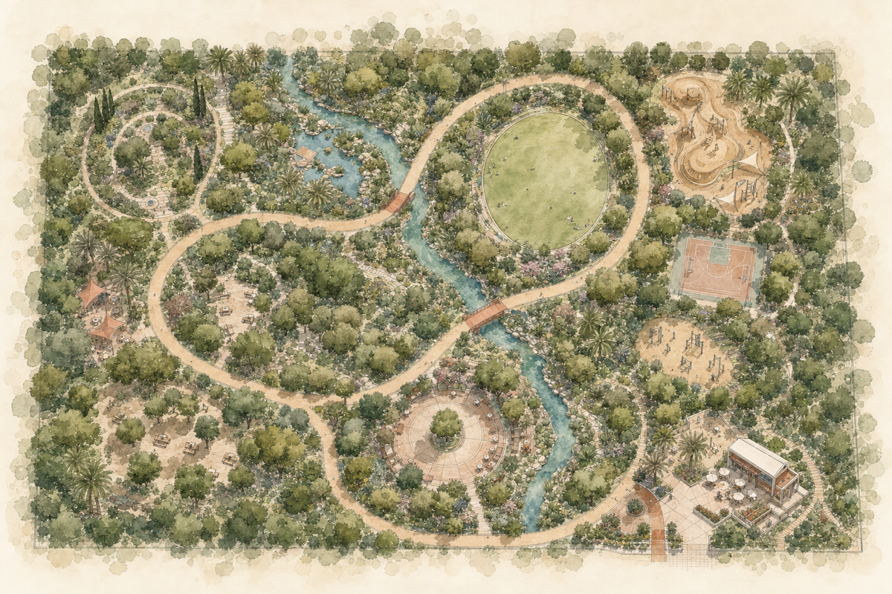
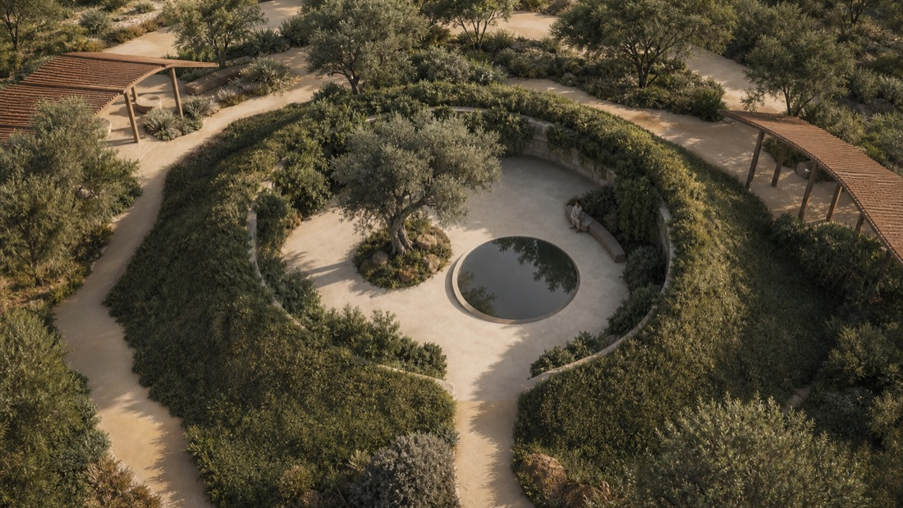
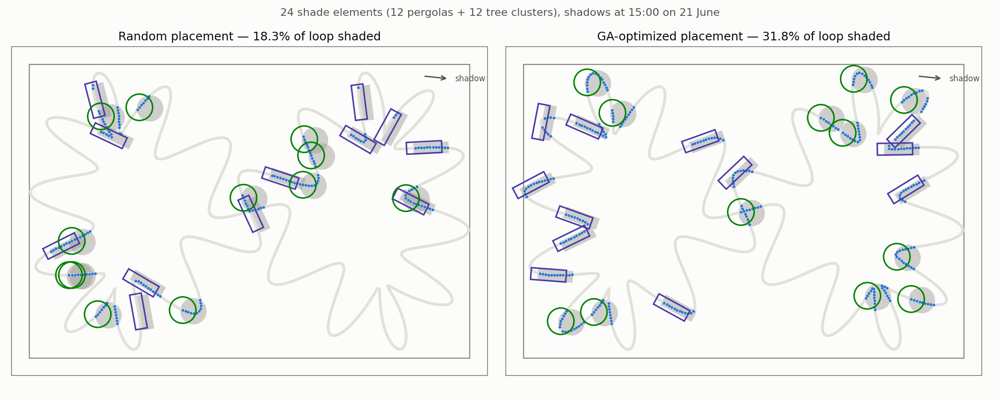
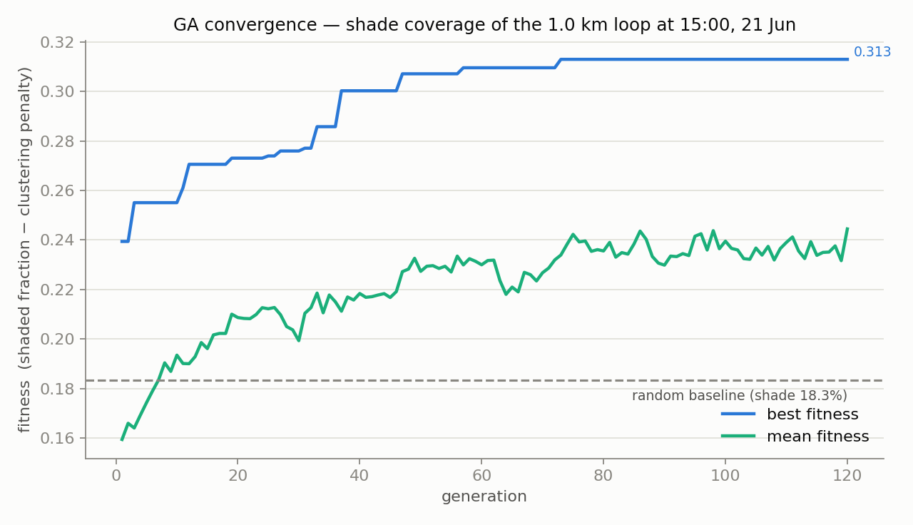
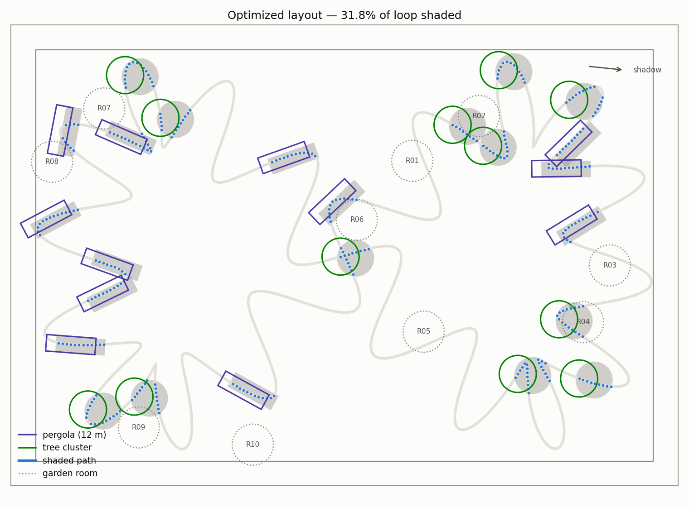

# nabta loop optimizer

**A proof-of-concept of the generative-optimization engine behind the *nabta* wellness-park entry to the [Dubai Municipality AI Park Design Challenge](https://aipark.dm.gov.ae/ai-competition).**



The *nabta* entry organizes Al Safa Park 2 (25.1635 N, 55.2308 E) around a **1.0 km continuously shaded figure-eight loop** — part canopy forest, part AI-form-found pergola — threading ten garden rooms. The competition entry claims that the shade strategy was not drawn by hand: **43 masterplan variants were generated and scored on shade continuity, walkability, sightline safety and irrigation demand**, with an evolutionary optimizer deciding where canopy goes.

This repository is the small, honest, runnable core of that claim: a genetic algorithm that places a fixed budget of shade elements along the loop and demonstrably beats random placement on the design condition that matters most in Dubai — **the shaded fraction of the path at 15:00 on 21 June**.



---

## Result

| Layout | Loop shaded at 15:00, 21 Jun |
|---|---|
| Random placement (mean of 300 layouts) | **18.3 %** (± 2.0, best of 300 = 24.5 %) |
| GA-optimized placement | **31.8 %** |

Same budget — 24 elements, zero extra material — **1.7× more of the loop in shadow**, purely from *where* the elements sit and how pergolas align with the 15:00 sun vector.



Two behaviors emerge without being programmed in:

1. **Pergolas rotate onto path segments running parallel to the shadow vector.** At 53.7° sun elevation a 3.2 m canopy throws its shadow only 2.35 m sideways, so a pergola across an east-west segment shades almost its full 12 m of path, while one on a north-south segment shades almost nothing. The GA discovers this from the fitness signal alone.
2. **Tree clusters migrate to where the meander doubles back on itself**, so a single canopy shadow intercepts two or three passes of the path at once.





The final layout, with the ten garden rooms of the entry dotted for context.

---

## How it works

| File | What it does |
|---|---|
| [`loop.py`](loop.py) | Parametrizes the 1.0 km figure-eight loop as a closed 2D polyline in a 150 × 100 m site: a Gerono lemniscate plus a smooth meander whose amplitude is solved by bisection so the closed loop measures exactly 1000 m, then resampled to 1000 points at uniform 1 m arc-length spacing. |
| [`solar.py`](solar.py) | Sun elevation/azimuth from standard formulas (Cooper declination, Spencer equation of time, hour-angle geometry). At 15:00 GST on 21 June at the site: **elevation 53.7°, azimuth 275.9°** — shadows fall 0.73 × canopy-height, almost due east. |
| [`optimizer.py`](optimizer.py) | The genetic algorithm, the shading model, and all plotting. |

### The shading model

- **Budget:** 24 elements — 12 pergola segments (12 m × 4 m, 3.2 m canopy) + 12 tree clusters (4.5 m canopy radius, 5 m effective canopy height).
- **Genome:** 24 floats in [0, 1) — each element's arc-length fraction along the loop. Pergolas align with the local path tangent.
- **Shadow:** each element's footprint translated by the sun vector (`h / tan(elevation)` in the anti-azimuth direction). A path sample is shaded if it falls inside any translated footprint.
- **Fitness:** `shaded_fraction − 0.5 × clustering_penalty`, where the penalty grows quadratically for consecutive arc-length gaps under 15 m, so shade doesn't pile onto one bend.

### The GA

- Population **80**, **120 generations**, elitism of 2
- **Tournament selection** (k = 3), **uniform crossover** (p = 0.9), **gaussian mutation** (σ = 0.02 of the loop ≈ 20 m, per-gene p = 0.2, wrapping around the loop)
- Fully vectorized: a whole generation is scored as one numpy broadcast of shape `(population, elements, path-samples)`. The complete run — 300-layout baseline plus 9 680 GA evaluations — takes **~4 seconds** on a laptop.

## Run it

```bash
pip install -r requirements.txt
python optimizer.py            # writes the three PNGs into assets/
python optimizer.py --seed 7   # different seed, same story
python loop.py                 # sanity-check the geometry
python solar.py                # sanity-check the sun position
```

Pure `numpy` + `matplotlib`, no other dependencies.

## Branches

- **`main`** — single objective: maximize shade, penalize clustering.
- **`experiment/multiobjective`** — the element *mix* becomes part of the genome and a **water-demand penalty** (tree clusters cost irrigation; pergolas don't) is added to the fitness, reproducing the shade-vs-irrigation trade-off the 43 entry variants were scored on.

## Honest limitations

This is a proof of concept of the *optimization engine*, not a shade study:

- The loop geometry is stylized — a meandered lemniscate sized to 1.0 km inside a 150 × 100 m rectangle, not the surveyed Al Safa Park 2 parcel.
- One instant (15:00, 21 Jun), one sun position; the entry's full workflow scores shade continuity across the whole afternoon and seasons.
- Shadows are flat translated footprints on a line-width path — no path width, no mutual occlusion, no penumbra, no neighboring-building shadows, no UTCI/wind coupling.
- 24 elements is a deliberately tiny budget so the optimization signal is visible; the entry's "92 % of the loop shaded at 3 pm" figure comes from a full canopy-forest planting plan plus continuous pergola ribbons, hundreds of elements — the absolute percentages here are not comparable and aren't meant to be. What this POC demonstrates is the *mechanism*: the same budget goes 1.7× further when an evolutionary search places it.
- A GA is one of several ways to solve this; it's used here because it is the method described in the entry.

## Challenge

Dubai Municipality — **AI Park Design Challenge** (Al Safa Park 2): <https://aipark.dm.gov.ae/ai-competition>
Announcement: [Dubai Media Office, 28 Jun 2026](https://www.mediaoffice.ae/en/news/2026/jun/28-06/dubai-municipality-launches-world-first-ai-powered-park-design-challenge)

## License

[MIT](LICENSE)
